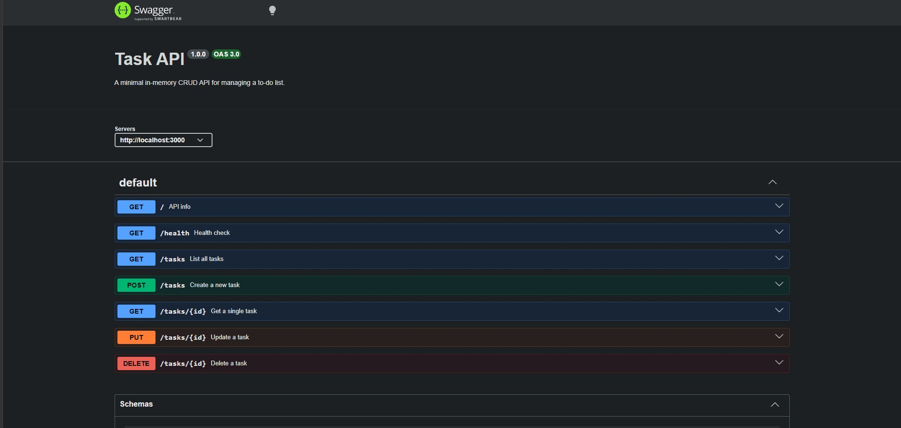

# Task API

A CRUD API for managing a to-do list, built with Express and backed by a real SQLite database. The API surface is identical to the in-memory version from Assignment 1 — same endpoints, same request/response shapes, same status codes. Only the storage layer changed.

## Install & run

```bash
npm install
npm start
```

The server starts on **http://localhost:3000**. Interactive Swagger docs are at **http://localhost:3000/docs**. On first run it automatically creates `tasks.db` and seeds it with 3 example tasks; on every run after that, your existing data is just... there.

## Why SQLite

- **Zero setup.** No server to install or run — `tasks.db` is a single file, created automatically the first time the app starts.
- **Real persistence for basically no cost.** Assignment 1's data vanished on every restart. Swapping the storage layer for SQLite fixes that without touching a single route.
- **A natural stepping stone.** The same query patterns (parameterized SQL, prepared statements) carry over almost unchanged if this project later moves to Postgres or MySQL.

**Driver note:** this uses Node's built-in [`node:sqlite`](https://nodejs.org/api/sqlite.html) module instead of `better-sqlite3`. Both have the same synchronous, prepared-statement API; `better-sqlite3` needs a C++ toolchain to compile on install (Visual Studio Build Tools on Windows), while `node:sqlite` ships with Node itself — no install step, same tradeoff Python's lane gets for free with its built-in `sqlite3`. Needs Node 22.5+. You'll see an `ExperimentalWarning` in the console on startup — harmless, just Node flagging that the module's API could still change in a future release.

## Where the data lives

`tasks.db`, in the project root, created on first run. It's git-ignored on purpose — every fresh clone starts with a clean database and reseeds the 3 example tasks, rather than shipping a stale data file through git.

## Endpoints

| Method | Path         | Description                                |
|--------|--------------|---------------------------------------------|
| GET    | `/`          | API info                                    |
| GET    | `/health`    | Health check                                |
| GET    | `/tasks`     | List all tasks                              |
| GET    | `/tasks/:id` | Get a single task                           |
| POST   | `/tasks`     | Create a task — body `{ "title": "..." }`   |
| PUT    | `/tasks/:id` | Update a task's `title` and/or `done`       |
| DELETE | `/tasks/:id` | Delete a task                               |

Status codes: `200` for reads/updates, `201` for create, `204` for delete, `400` for an invalid body, `404` for an unknown id. Every error comes back as `{ "error": "..." }`. All queries use `?` parameter placeholders — no request value is ever glued into a SQL string.

## Example request

```
$ curl -i -X POST http://localhost:3000/tasks -H "Content-Type: application/json" -d '{"title":"Write tests"}'

HTTP/1.1 201 Created
X-Powered-By: Express
Content-Type: application/json; charset=utf-8
Content-Length: 43

{"id":4,"title":"Write tests","done":false}
```

Restart the server after running that, then `GET /tasks` again — task 4 is still there. That's the entire point of this assignment.

## Swagger UI



*(Placeholder — run the server, open `/docs`, try the full CRUD cycle with "Try it out", then drop your own screenshot in as `swagger-screenshot.png`.)*

## Exploring the database by hand

See [`SQL_NOTES.md`](SQL_NOTES.md) for the Stage 4 queries and a live example of the API reflecting a change made directly to `tasks.db`, with no restart, via `UPDATE tasks SET done = 1 WHERE id = 1;`.


*(Placeholder — open `tasks.db` in [DB Browser for SQLite](https://sqlitebrowser.org/), run the queries in `SQL_NOTES.md` yourself, and drop a screenshot in as `db-browser-screenshot.png`.)*

## Notes

- `node_modules/` and `tasks.db` are both git-ignored. Run `npm install` after cloning — the database recreates and reseeds itself automatically on first start.
- The seed (3 example tasks) only ever runs once, wrapped in a transaction so it's all-or-nothing — restarting the server never duplicates them.
